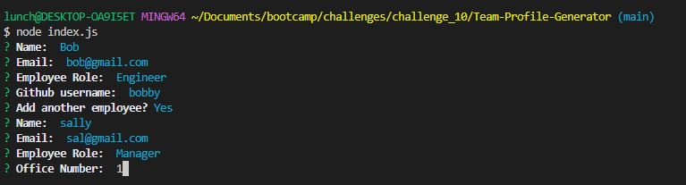
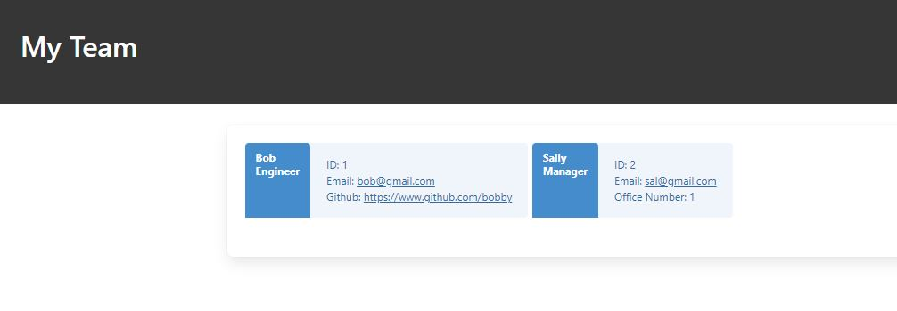

# Team Profile Generator

## Description
Create a webpage that displays the members on your team.

## Table of Contents
 - [Team Profile Generator](#team-profile-generator)
 - [Description](#description)
 - [Installation Instructions](#installation-instructions)
 - [Usage Information](#usage-information)
 - [License](#license)
 - [Contribution Guidelines](#contribution-guidelines)
 - [Testing Instructions](#testing-instructions)
 - [Questions?](#questions)

## Questions?
- Github: https://github.com/lunchtimewhee 
- Email: anthonyrli1994@gmail.com

## Installation Instructions
1. Clone repo from https://github.com/lunchtimewhee/Team-Profile-Generator

2. Open with node index.js

## Usage Information
1. Enter team member information:
[]

2. Info will be displayed on the generated website:
[]

## License

## Contribution Guidelines
Please reach out to Anthony at the given contact information

## Testing Instructions
N/A

